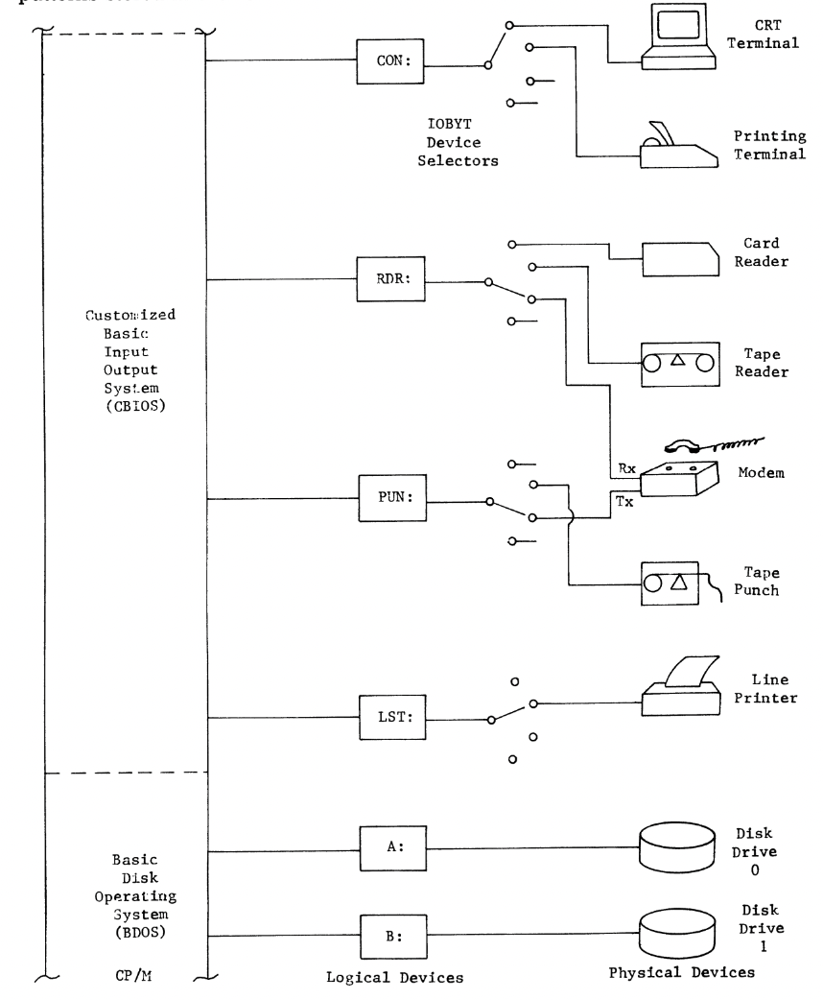
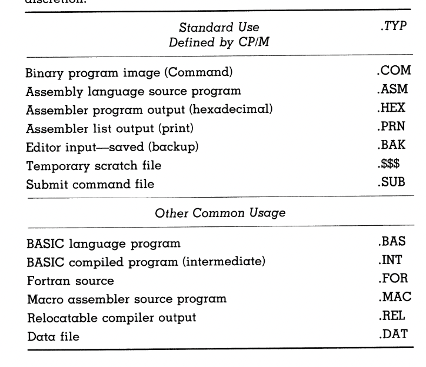

# The CP/M - Based Computer

 - For the exercises in this book, you need a microcomputer with a minimal setup running CP/M (version 1.4, 2.0, 2.2).
 - We'll focus on the devices shown in Fig. 1-1, but discuss more complex systems as well.
- You've learned relevant microcomputer terminology, and now we'll use CP/M's logical and physical device names.

## Logical names and physical entities

 - Referring to your operator's console video display terminal as "CRT:" simplifies things.
 - The CRT: serves as the operator's console, known as logical device CON::.
 - In Fig. 1-1, there are three other physical devices: LPT: (line printer) and two disk drives numbered 0 and 1.
 - Disk drives are simply numbered (0, 1, 2, etc.) without three-letter-plus-colon designations.
 - Logical disk drive names like A:, B:, etc., directly correspond to physical drives in our minimal system.
 - Fig. 3-1 shows four logical I/O devices accessible through CP/M.
 - We've discussed "CON:" and "LPT:" for program listings, connected as logical device "LST:" (list device).
 - General-purpose input and output devices use "RDR:" and "PUN:," or "PTR:" and "PTP:" for paper tape reader and punch if used.

## Selecting I/O Devices

 - In the "IOBYT Device Selectors" section of Fig. 3-1, there are four selector switches represented schematically.
 - If actual switches were connected as shown, they could be used to switch between different I/O devices. For example, the RDR: switch could select data from a card reader, paper tape reader, or the receive side (Rx) of a modem based on its setting.
 - CP/M, inherited from the MDS system, allows selecting any of four physical devices for each logical device. Instead of physical switches, this is achieved using bit patterns stored in a one-byte memory location called IOBYT.

 - **Figure 3-1**: CP/M maps logical to physical devices and selects them based on bit patterns stored in IOBYT, using device driver subroutines in the operating system.

 - Leaving physical devices permanently connected to the computer but selecting them in software offers flexibility.
 - The operator can make selections through the CP/M CON: interface, or programs can change them without notice.
 - Not all sixteen selector inputs need to be connected to physical devices, as long as we know which device corresponds to each IOBYT setting.
 - Devices like modems with both send and receive functions require proper settings in both RDR: and PUN: sections of the IOBYT. CON: is the only bidirectional logical device.
 - CP/M allows changing device selections through the same entry vector used in our machine language routine from the Introduction or through CON: operator actions, discussed further in Chap. 5.
 - In our minimal system, we won't need to change the IOBYT switches and will only use CRT: as CON: and LPT: as LST:.

# What the Operating System Provides

 - Hardware components' services are evident due to their inherent functions in a computer system like Fig. 1-1.

 - The services provided by software components are less obvious, especially in complex systems like ours.

 - Multiple paths exist for accessing devices, making it challenging to track software interactions compared to hardware.

 - This section explores CP/M from an operator and programmer perspective. We'll use a few CP/M commands; you don't need to try all commands until later sections.

 - You can experiment with disk file operations on a clean disk but avoid using others' disks if sharing access.

 - Be cautious, as mishandling shared disks might lead to complications beyond learning assembly language.

## Named file handling

 - Computer files are like labeled folders; CP/M file names are up to eight characters long, followed by a three-character type.
 - Certain types have fixed meanings (e.g., ".ASM" for assembly language).
 - You can create custom types for your files.
 - Use creative naming and types but think about meaningful choices.
 - Creating an empty file with a unique name and type can label disks.
 - CP/M provides flexibility in file naming and types for both console and program use.

### Table 4-1

 - This table lists standard file types for CP/M disk files. The .TYP field in file names should match these established designations. Operators can use other designations for different file types as needed.

## Wildcards in File Names

 - CP/M supports wildcards in file names for flexible file searches.
 - You can use wildcards like "?", "*", or specific names to specify files.
 - CP/M utilities and programs accept these wildcards and drive identifiers, offering flexibility and ease of use.
 - Consistent file access routines in CP/M make your own programs flexible in accessing named files, simplifying programming.

## Logical unit access

 - CP/M simplifies access to logical units and their corresponding physical devices.
 - Operators can specify logical units within commands, allowing data to be sent to the connected physical device.
 - Programs can also access logical devices without needing to know the connected physical devices.
 - This flexibility can be used for data communications programs, and logical device assignments can be changed by the operator or user program.
 - Details of these mechanisms will be discussed in later chapters.
 - CP/M's design simplifies file and device access, making it user-friendly and relieving programmers of complex device management tasks.

## Line editing

 - CP/M offers built-in line editing for fixing single-key errors in command lines.
Correct errors by pressing DEL, DELETE, BS, or RUBOUT keys, depending on your terminal.
 - Some CP/M versions may not back up the cursor and show deletions by repeating characters.
 - Review a command line by entering CTRL R.
 - Abort the entry by typing CTRL U or CTRL X if needed.
 - These are the essential line editing controls; more exist but aren't necessary for beginners.
 - Programmers can use these controls to create user-friendly software.
 - Detailed instructions for using these features in programs will be provided later.
 - It's advisable to practice these features now for familiarity.