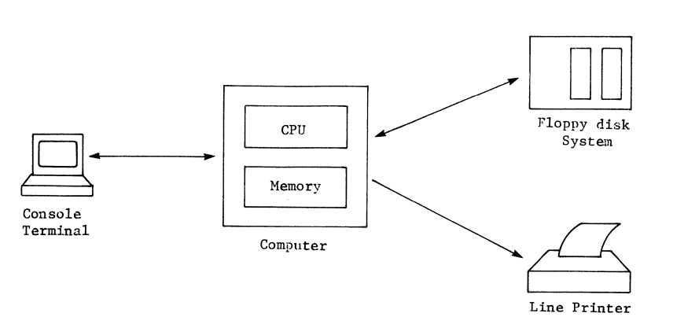

## Section: Introduction

 - Newcomers in technical fields struggle with unfamiliar terminology.
 - Technical fields develop their own jargon.
 - Many different names exist for the same item in technical contexts.

## Section: Defining Terms

 - Terminal can also be called a console, screen, CRT, VDI, CON, or TTY.
 - "Monitor" can refer to a computer program or a part of a computer.
 - Synonyms will be avoided, and terms will be defined in this book.
 - Different people may use different terms for the same things.
 - Upcoming sections will define more computer related terms.

## Section: The Computer Operator

 - There are two classes at computer terminals: users and programmers.
 - Users are often identifiable, e.g., children playing games, while programmers may appear disheveled.
 - Some programs meant for non-programmers are poorly designed, requiring programmer skills.
 - Vital lesson: Programs must not only work but also be user-friendly for non-programmers.
 - Start thinking about program usability from the beginning, before writing any code.
 - What's obvious now may be forgotten later; frustrating to be unable to run your own program.
 - CP/M OS allows naming and calling programs; users need to remember what each program does.
 - Even your own program should be written with usability in mind.
 - Every program worth writing is worth writing properly, with the first step being usability for the "unsophisticated user."
 - Becoming an expert programmer is essential, but remember to make your creations usable by anyone, whether a computer user or programmer.
 - Definitions established for "terminal," "computer operators," "computer users," and "computer programmers."

## Section: The Operator's Console
- Early computers had operator's consoles with lights, switches, and patch cords.
- Programs were input through patch cords or manually using switches.
- The term "console" transitioned to terminal devices when operators could communicate from a terminal.
- Some computers still have switches-and-lights consoles, but this book focuses on console terminals.
- The standard computer terminal in the past was the ASR-33 from the Teletype Corporation.
- About 300,000 ASR-33 terminals were produced, primarily for telex messaging.
- The ASR-33 was popular due to its affordability, durability, and features like a keyboard, printer, and paper tape punch/reader.
- It became the standard console for minicomputers because CRT terminals were not inexpensive five years ago.
- The term "ASR-33 Teletype" is often used.

## Section: The Computer

- Computers come in various sizes, from mainframes to microcomputers.
- Each computer has a central processing unit (CPU) at its core.
- In the past, CPUs were separate racks filled with circuit boards and heat.
- Another rack was needed for a modest 16K words of memory.
- Integrated circuits replaced discrete devices (transistors, resistors), making compact computers possible.
- Modern computers can fit in one hand, but they all have a CPU.
- The CPU processes data, regardless of whether it's part of an integrated circuit or a rack full of circuit boards.
- Data may come from other parts of the computer, but the CPU is responsible for data manipulation.

## The 8080 and its Relatives

- In our CP/M based computer system, the CPU belongs to the 8080 microprocessor family.
- The Intel 8080 microprocessor was not the first micro, but it had a significant impact.
- Its predecessors were limited in computing power, mainly serving as smart controllers.
- The 8080 changed things in 1975 with its powerful instruction set, available in a single integrated circuit.
- The 8080 instruction set became an industry standard, making it both useful and easily programmable.
- While advocates of other microprocessors pointed out deficiencies, the 8080 instruction set became the industry standard.
- The 8080 integrated circuit had shortcomings: relatively slow, required three different power supply voltages, and needed extra ICs for clocks and system control.
- Intel later produced the 8085 microprocessor, which simplified hardware design and improved operating speed.
- The 8085 requires a single +5 volt DC power supply, a crystal or a resistor-capacitor (RC) network between pins 1 and 2, and memory and I/O devices like all microprocessors.
- The 8085 greatly simplifies hardware design and increases operating speed.
- There are other members of the 8080 family that will be discussed in detail in Part III.
- CP/M is written using 8080 instructions, so a member of this family must be our CPU.

## Instructions in Memory

- A CPU requires instructions to operate, stored as operation codes (opcodes) in memory.
- The CPU fetches instructions from memory, decodes them, executes them, and proceeds to the next instruction.
- A meaningful sequence of instructions in memory forms a machine language program.
- Opcodes must be in a machine-readable format, typically 8 binary digits or bits for the 8080.
- Originally, opcodes were manually entered using switches-and-lights consoles, which was slow and error-prone.
- Microcomputers later included a loader program in ROM to automatically load programs from input devices like paper tape readers into read-write memory (RAM).
- In dedicated-purpose computers, all software can be permanently stored in ROM, but general-purpose computers require RAM for changing programs and data storage.
- RAM stands for Random Access Memory, distinguishing it from sequential access memory like paper tape.
- Two relevant acronyms: PROM (Programmable ROM) and EPROM (Erasable PROM). PROMs have a fixed program, while EPROMs allow for erasing and reprogramming.
- The basic components of a computer include the CPU (8080 family), a loader program in ROM (PROM or EPROM), and RAM for program and data storage.
- I/O devices are needed for communication with mass storage.

## Mass Storage

- Initially, it was believed that 4,000 words of storage with 40-bit long words would be sufficient for any computation on the first digital computer.
- Modern microcomputers use 8-bit bytes for calculations and laugh at the idea of having only 4K of RAM.
- The 8080 family of microprocessors can directly address 65,536 bytes or 64K of memory.
- Mass storage, which includes external memory like tapes, disks, drums, or RAM accessed outside the main memory address space, has been essential since the early days of computers.
- On CP/M-based microcomputers, mass storage often consists of two floppy disk drives with varying capacities (e.g., 70K bytes to several million bytes per drive).
- Main memory inside the computer is addressed byte by byte, ranging from zero to 65,535.
- In contrast, mass storage addresses are not as easily organized, making it impractical to give each byte a unique address when dealing with millions of bytes.

## Disk Addressing

- Data on disks is organized into circular tracks, each divided into sectors.
- Sectors have unique addresses, like "track 14 sector 23," and contain strings of data bytes called records.
- In the original CP/M system, each record contained 128 bytes.
- Different types of floppy disks and hard disk drives may use varying sector sizes, but we don't need to delve into these specifics.
- We don't need to remember complex disk addresses, such as "disk drive 2 at track 32 sector 14," thanks to the CP/M operating system.
- CP/M manages mass storage addressing details for us.
- As computer users or programmers, we create named files on our mass storage devices, and the operating system handles disk space allocation.
- We only need to keep track of file names and their associated drives.
- CP/M simplifies the management of disk organization, sparing us from dealing with low-level details.
- In this enlightened age, we have the convenience of CP/M to handle these complexities.

## Hard Copy

- Assembly language programming, the focus of this book, often involves long and detailed programs.
- Hard copy output peripherals are virtually essential for assembly language programming.
- In the past, with devices like the TTY, hard copy was unavoidable, and everything typed and computer output was printed.
- Modern computer systems allow you to clear error messages from your CRT screen when necessary.
- Printing terminals like the TTY and its descendants print one character at a time.
- Line printers, on the other hand, store characters in a buffer until they receive a termination character, typically a carriage return (CR), then print the entire buffer at once.
- Line printers can print at rates ranging from about 50 to 300 characters per second.
- Some line printers use mechanisms other than a moving print head and can consume paper rapidly.
- In a typical CP/M based computer system, it's assumed that there is a lower-priced line printer.
- This device can be the printer portion of the console terminal if configured as such but will be considered a separate device in discussions of device names (Chap. 3).
- Some CRT terminals have built-in printer ports, and some all-in-one computer systems have screen printing functions.
- Screen printing allows saving the CRT screen contents as hard copy but is not a built-in function in CP/M, so it's not assumed in our example system.

## Other Peripherals

- Our CP/M based microcomputer, with its operator's console, CPU, memory, mass storage, and hard copy device, is ready to perform.
- Additional peripherals might be needed in certain situations.
- Floppy disk systems adhering to standard formats allow program and data exchange with other computers following the same standard, often requiring transporting the disk.
- Paper tape readers are old but reliable input devices, capable of reading at various speeds, and paper tape punches serve as output devices.
- Mentioning these slow devices in the context of a modern CP/M-based computer is due to the inherited device names in the CP/M operating system.
- Being able to read paper tape reduces reliance on floppy disk compatibility but is still limiting.
- Modems (modulator-demodulators) enable communication with other computers over telephone lines by modulating and demodulating data.
- Modems connect two computers via a telephone circuit, allowing data transfer, provided they use the same standardized code, ASCII (American Standard Code for Information Interchange).
- Various I/O devices are available, but those resembling modems and communicating in ASCII can be connected to most computers.
- Specific interfacing conventions might limit some devices to use with specific computer makes.
- Further details will be explored later.

## A Simple Computer System

- The computer system shown in Fig. 1-1 represents the minimum hardware configuration for the exercises in this book.
- It is assumed that the reader has access to such a system with at least one floppy disk drive.
- A minimum of 16K RAM is required, along with either a hard copy device or a high level of patience.
- The following discussions will delve into the CP/M operating system in detail and examine the 8080 microprocessor from a programmer's perspective.
- With this foundational knowledge, the book will guide readers through simple assembly language programming.
- Learning will be achieved by writing, editing, assembling, and debugging programs, providing a more practical approach than exhaustive study of a computer's instruction set and hardware configuration before programming.
- In this chapter, we've acquired essential terms for discussing the computer system and programming.
- We've also examined the components of a computer and defined the minimum system necessary for advancing in assembly language programming under the CP/M operating system.
