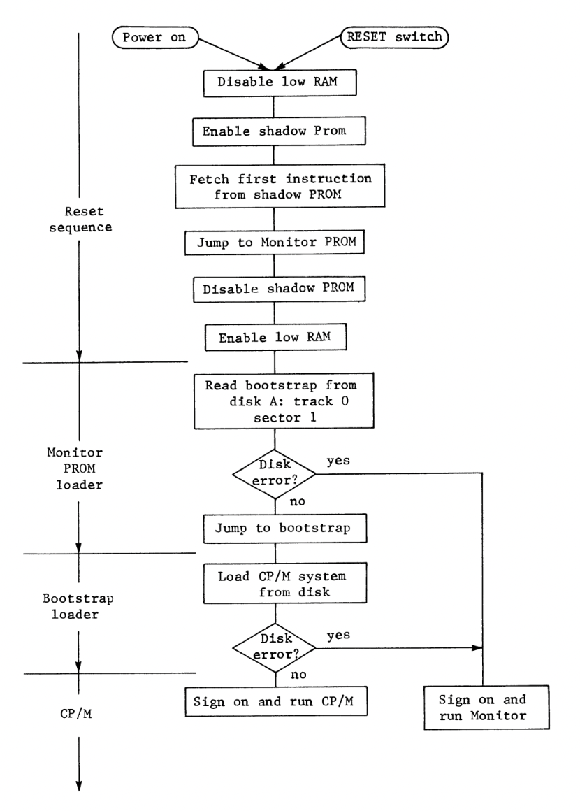
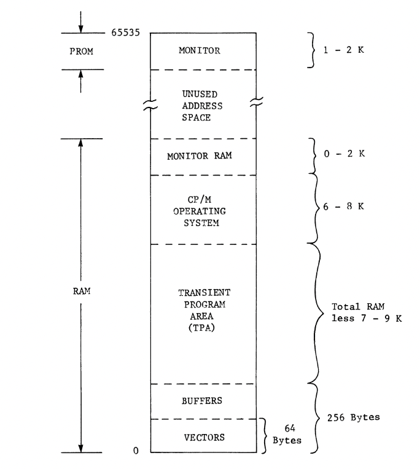

# Software Components of the Computer System

 - **Hardware** are the physical computer parts, capable of causing floor dents when dropped.
 - **Software** refers to the computer programs, distinct from hardware.
 - In the '70s, computers mainly used **magnetic core memory**, which retained data even without power.
 - An initial minimal **loader program** was used to load the operating system from mass storage.
 - The "bootstrap loader" ensured proper loading.
 - Semiconductor memory replaced core memory but was vulnerable to data loss due to power issues.
 - **ROM** was used for bootstrap loaders as PROMs became affordable, reducing front panel switches and lights.
 - The term **"firmware"** was coined for ROM-stored software to distinguish it from volatile RAM-based software.
 - The chapter introduces **software**(volatile RAM programs) and **firmware**(permanent ROM programs) in computers.

## Firmware Monitor

 - Microprocessor ICs like the 8080 family start by fetching an instruction from memory location zero upon reset (automatic or manual).
 - In CP/M systems, where the low end of memory needs read-write RAM, a **bootup circuit** tricks the computer. It replaces RAM at location zero with a "shadow PROM" during reset.
 - The shadow PROM provides one or more instructions that the CPU executes. Eventually, it's told to switch back to RAM at location zero.
 - Typically, the first instruction fetched from the shadow PROM is an unconditional jump to a monitor program in ROM, often at the top of memory.
 - The CPU knows to fetch the next instruction from the jumped-to location.
 - The **address bus**, with sixteen signal lines, carries memory location addresses for read or write. The bootup circuit watches for the most significant bit and switches from shadow PROM to RAM.
 - Reset and bootup procedures are essential for computer operation but don't require deep hardware knowledge.
 - Turning on the computer or gently pressing reset starts it up. Manual resets are common in case of program failures.
 - After reset, the CPU fetches instructions from the **monitor PROM**. In modern contexts, "monitor" may have a different meaning.
 - Traditional monitor programs use the console to interact with the operator, providing routines for hardware diagnostics and debugging assembly language programs.

### Figure 2 - 1

 - A flowchart outlining the series of operations required to start up a standard microcomputer.

 - While many of these operations remain hidden from the operator, assembly language programmers closely engaged with the computer's hardware and software components need to comprehend this bootup sequence.

 - A complete monitor can help with debugging.
 - CP/M includes DDT for debugging.
 - Some monitors offer peripheral driver programs.
 - CP/M provides equivalent functions.
 - A loader program in monitor PROM is essential.
 - CP/M loads and runs on reset with a system disk in the drive.

## The operating system

 - **CP/M** is our computer's operating system, originally developed for the Intel MDS-800 and adapted for various computer models due to its hardware adaptability.
 - Unlike other standardized aspects, **I/O port assignments** have never been consistent across computers, making it challenging for drivers.
 - CP/M eliminates this issue, allowing it to work across diverse hardware environments without requiring hardware-specific drivers.
 - Operations involving **mass storage devices** are intricate, but CP/M simplifies the process by handling disk access and I/O port operations.

## Customizing CPM

 - Adapting CP/M to specific hardware is a one-time task, typically done by assembly language programmers.
 - CP/M has user-to-system conventions that simplify software development. All disk and I/O accesses use function codes and data addresses in registers.
 - These conventions enable portable program development, meaning programs can run on different hardware without modification.
 - Some programmers still use hardware-specific addresses, but it's unnecessary with CP/M. We'll prioritize portability in our programs and avoid these mistakes.

## Application Programs

 - RAM for user programs depends on the computer's configuration; 16K RAM is typically sufficient.
 - User programs run in the "transient program area" (TPA) within RAM.
 - Smaller systems may need to overlay part of CP/M for more user workspace without affecting disk and I/O access.
 - User programs are collectively referred to as application programs.
 - CP/M's editor, assembler, loader, and debugger are used during application program development and loaded into the TPA temporarily.

## Special Memory Areas

 - At the lowest RAM addresses are **vectors**, used as unconditional jump instructions for hardware interrupts. The 8080 family uses eight, and additional vectors exist in the Z80 and 8085. We don't need to worry about the details for now; we just shouldn't disrupt these memory areas.
 - CP/M allocates buffer areas above the vectors for interfacing our programs with the operating system. These buffers occupy 256 locations at the bottom of RAM, with the TPA starting afterward.
 - Some RAM areas may be reserved for **monitor functions**, although this varies between computers. Monitors can range from using a few locations to several kilobytes for functions like memory-mapped display images.
 - Programmers adapting CP/M to specific computers ensure the operating system doesn't use RAM required by the monitor or other computer-specific functions. This sometimes results in a 46K version of CP/M running on a 48K RAM system, with the extra 2K allocated for other purposes.
 - This chapter introduced three basic program types: the **monitor**, the **operating system**, and **application programs**. The memory map illustrates how these software elements occupy memory in a CP/M-based computer.

## Figure 2 - 2

 - This figure displays a simplified memory map of a typical microcomputer running the CP/M operating system. Specific memory addresses are not shown since they depend on available memory and the size/version of CP/M installed.

