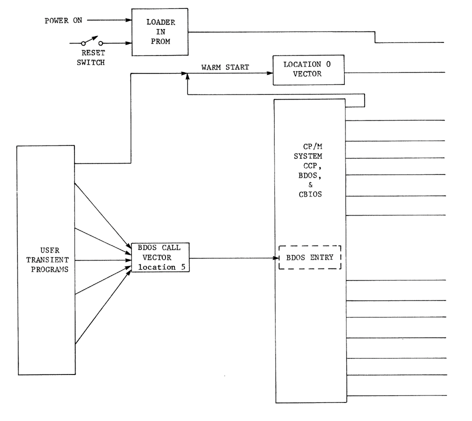
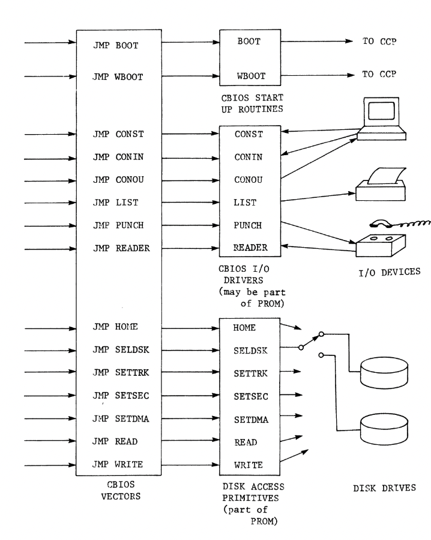
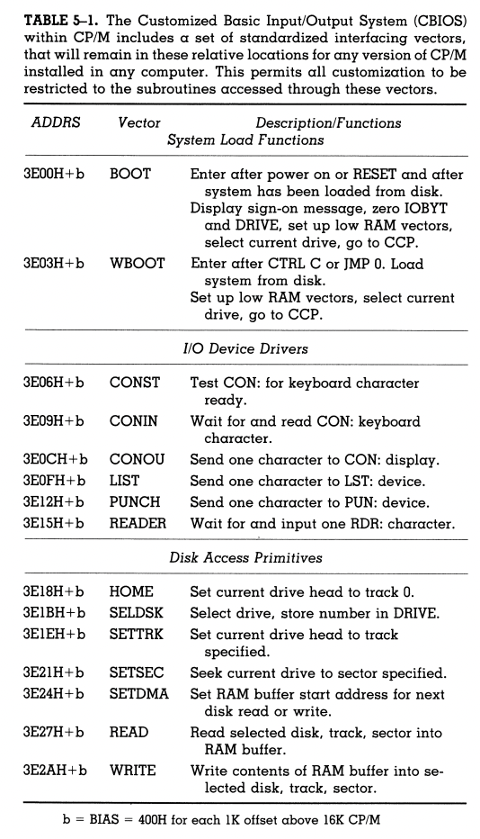
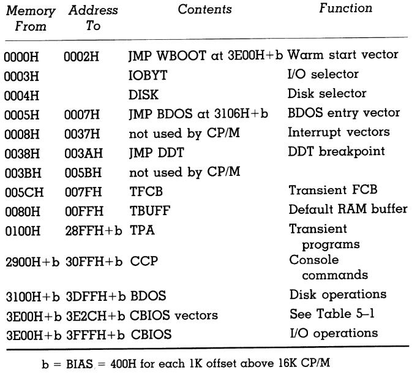
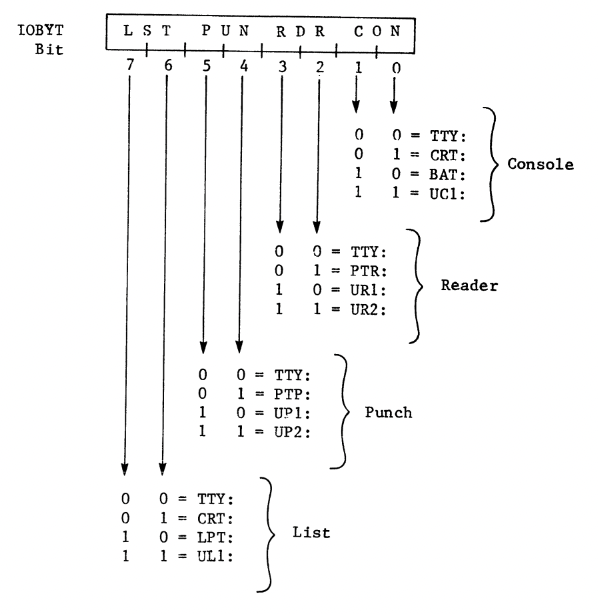
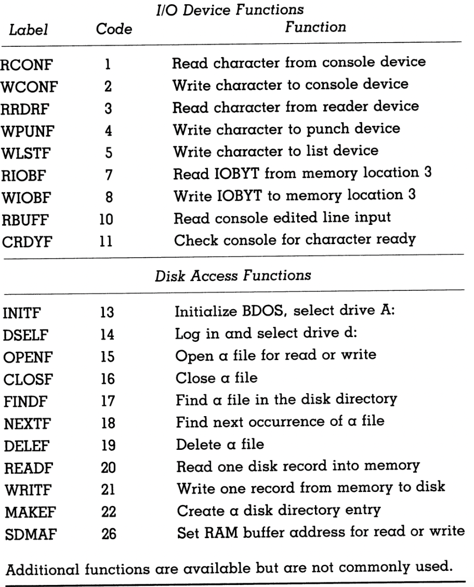

# Organization of CP/M

 - CP/M requires low-level driver routines to interface with physical devices through computer hardware.
 - Assembly language programmers are key in creating and extending CP/M systems.
 - They can modify or adapt the operating system to different computer environments.

## Disk and I/O access primitives

 - Loader Program: Needed for loading the operating system from disk into RAM.
 - Warm Start: Used when restarting CP/M without altering disk drive or device mapping.
 - Disk Access Primitives: Routines for low-level disk access, positioning the drive head, and loading the operating system.
 - Customization: Linking CP/M functions to specific hardware, ensuring compatibility.
 - I/O Device Access: Specific driver routines required due to CP/M's lack of I/O port knowledge.
 - Vector Table: Area containing pointers for coordinating CP/M with hardware.
 - Vector Table: Three-byte jump instructions (e.g., JMP BOOT) for coordinating CP/M and hardware
 - Absolute Addresses: Addresses for a 16K CP/M version.
 - BOOT Routines: Initiate system, display sign-on message, zero IOBYT and DRIVE select bytes, and set vectors at locations 0 and 5.
 - WBOOT: For warm starts, reloads CP/M using PROM loader and preserves DRIVE and IOBYT settings.
 - Console Command Processor (CCP): Activates CP/M, prompts for commands from CON: device.
 - I/O Device Communication: Six vectors connecting CCP, CP/M, and user programs with I/O devices.
 - Disk Access Vectors: Seven vectors that facilitate all disk operations, requiring human input for tasks like inserting disks.
 - Customization: Adapting CP/M to new computers involves providing a PROM loader and 15 driver routines connected through these vectors.

### Figure 5 - 1

 - User Programs: Interact with devices through the BDOS call vector and return via warm start.
 - CP/M System: Interfaces with user programs and manages device communication.
 - Hardware-Specific Support Routines: Primitive routines in ROM provide power-up, reset, and device driver functions. CP/M accesses these through CBIOS vectors.

### Table 5 - 1

 - Standardized interfacing vectors, consistent across all CP/M versions and computers.
 - Enables customization via the subroutines accessed through these vectors.

## BDOS—The Basic Disk Operating System

- BDOS (Basic Disk Operating System) manages the details of disk storage.
- Disk storage units consist of 128-byte records, which can be grouped as blocks and groups.
- 1 record = 128 bytes
- 1 block = 256 bytes = 2 records
- 1 group = 8 records = 1K bytes
- Users only need to instruct BDOS to handle file operations, and it will manage the intricacies.
- BDOS searches the directory for named files represented as File Control Blocks (FCBs) on disk.
- Files can consume a minimum of 1K byte groups even if they are smaller.
- Dynamic disk space allocation ensures efficient disk usage and avoids running out of space.
- BDOS keeps track of erased files to reuse disk space, which is essential for continuous operations.
- User programs and the operator can request file operations, with BDOS displaying error messages.
- BDOS retries reading or writing sectors upon checksum errors but may eventually display errors.
- Operators can either ignore errors or initiate a warm start (reboot) by typing CTRL C.
- A BDOS error can be critical, especially in program loading from .COM files.
- A "READ ONLY" BDOS error may occur when trying to write to a write-protected disk.
- Operator actions, such as changing disks, can resolve some disk access errors.
- BDOS error messages are shown on the console for program or human-related errors.
- In high-level language programs like BASIC, recovery from BDOS errors can be challenging, and it's crucial to make backup copies to avoid data loss.

## CBIOS—The Customized Basic Input/Output System

 - CP/M is a compact and adaptable operating system.
 - Despite its seemingly fragmented organization, CP/M efficiently utilizes available resources, designed for minimum 16K RAM.
 - Access to disks and I/O devices occurs through a single vector pointing to the BDOS entry point.
 - All other essential vectors (15 CBIOS vectors) are grouped together.
 - Sufficient memory space above these vectors allows customization to suit specific computer hardware.
 - Table 5-2 illustrates the memory map of CP/M version 1.4 in a minimum 16K system.
 - BIAS value accommodates the memory map of versions larger than 16K.
 - CP/M can be resized in 1K increments to fit various 8080 family microcomputers.
 - "BIOS" and "CBIOS" are sometimes used interchangeably, but "CBIOS" is more appropriate due to customizing for every computer.

### Table 5-2

 - Table 5-2: Memory map for CP/M version 1.4.
 - The portion below address 100 in hexadecimal remains consistent.
 - Addresses for the movable part of CP/M are given for a 16K version.
 - The bias value is added to these addresses depending on the installed size.

## Figure 5-2

- Figure 5-2: Subfields in the eight-bit IOBYT determine which of the four physical devices is accessed by each of the four logical devices in a CP/M-based computer.
- In minimal systems with few peripherals, implementing the IOBYT might not be necessary.
- Complex systems can utilize the IOBYT to streamline operator selection of input/output devices.
- The device names originated from the Intel MDS-800 development system that influenced CP/M.

- Inside CBIOS are I/O drivers, as depicted in Fig. 5-1, responsible for various device interactions.
- For systems implementing IOBYT, each logical device driver (e.g., CONIN, PUNCH) must decode the relevant bits from IOBYT to determine which physical device to communicate with.
- Odd device names, like CRT: or TTY:, stem from the early CP/M days and the Intel MDS-800 development system. Notably, there's no default name for a modem (e.g., MOD:).
- If you want to link a modem to PUN: and RDR:, you'll need a custom CBIOS driver to route them through UPI: and URI: respectively. This requires some assembly language programming skills.
- Alternatively, your custom CBIOS driver could use TTY: to talk to the modem if it's the primary peripheral.
- Understanding the system better and gaining assembly language programming knowledge can help customize device names.
- CP/M's BAT: was originally used for batch processing with a paper tape reader loaded with console commands. However, modern CP/M systems don't employ this batch mode and utilize SUBMIT for similar functionality. The meaning of BAT: remains undefined in contemporary contexts.

---------------------------

## CCP—The Console Command Processor

- CCP (Console Command Processor) prompts the operator for a command after CP/M is loaded, displaying the selected drive and a ">" symbol (e.g., A>).
- The command can be a resident function or a .COM file on disk. If it's a .COM file, it can include options.
- CCP processes resident commands, prompts for more input, and handles the execution.
- If CCP encounters an unrecognized command, it assumes it's a .COM file and helps the program by creating a default file control block (TFCB) containing the required file names and a RAM buffer with the entire command line, except the command itself.
- For instance, the operator can use CCP to launch a program like COMPARE, which compares disk files and displays differences. Options are also possible, like "PAUSE" to pause after each difference is shown.
- CCP eases the programming process by preparing these storage areas for transient programs, saving time for the CP/M assembly language programmer.

## Resident functions

- Resident functions are utility routines permanently stored in the computer's memory for fast execution.
- The division between resident and transient utilities is a design choice in CP/M. Resident functions are fast but consume memory space.
- A commonly used resident function is DIR, which displays files on the current disk or a specified drive.
- ERA is another resident function used to erase files, and it can be applied with options to delete specific file types.
- SAVE creates a file, and it can also save a program's contents to disk.
- REN renames a file. Remember that in assembly language, the convention is to specify everything backward.
- TYPE is a resident function that outputs the contents of a named file on the console. It can also list files on the line printer using CTRL P as a toggle for display output.
- Another toggle is CTRL S, which stops or resumes scrolling when viewing source program listings on the console.
- Proficient programmers can create customized BIOS versions, potentially implementing single-key pause controls or speed adjustments for better user experiences.

### Table 5-3

- CP/M provides utility functions divided into two classes: resident functions, always stored in memory, and transient functions, loaded into the transient program area temporarily.
- Resident functions execute quickly but consume memory space.
- Transient functions use memory space only until they finish their tasks.

## Transient utilities

- The `STAT` command displays statistics about .COM files on your disk, including its own stats. It's not a resident function because it's relatively large.
- `STAT` is primarily used to check disk space availability before updating files like `TEST.ASM`.
- You can also use `STAT` to view and change device assignments, such as `STAT DEV:` to see current assignments or `STAT LST:=LPT:` to change the logical list device to the line printer.
- Be cautious when changing assignments for `CON:`, as it can lead to the loss of your current console device. If that happens, you can regain the original console by hitting the RESET switch, but you'll lose any other reassignments.

## User programs

- There's no fundamental difference in form between a "CCP transient command" (utility) and a user program. Transient commands are essentially .COM files on the system disk.
- Our own user programs will be accessed in the same way, by entering a command line in CCP following the CCP prompt.
- CCP will parse the command line, loading one or two file names into the default file control block if they are present. Other entries in the command line will be saved in TBUFF for the user program to use.
- CP/M can perform various tasks for user programs, and the next chapter will explain how to organize programs to make the most of the services CP/M provides.

# Interfacing with CP/M

- While it's possible to write programs that perform tasks like comparing files, it's generally more efficient and practical to use CP/M's built-in features.
- The operating system takes care of many tasks for user programs, like parsing command lines, creating file control blocks, and handling other options.
- CP/M provides labor-saving facilities that should be utilized in your programs.
- To maintain program portability and adaptability to different CP/M versions and hardware configurations, it's recommended to use the BDOS call vector, a "giant hook" at location 5, to access system services.
- There is a common set of calling conventions for system service calls that rely on registers for passing parameters.
- Understanding the details of these system service calls will be covered in more detail throughout the book.
- Sometimes programming approaches may seem roundabout, but there are good reasons for these design choices.
- Accepting some programming concepts and techniques on faith is sometimes necessary due to the volume of background material that must be covered before diving into detailed programming.

### Table 6 - 1

- Commonly Used Functions in CP/M
- Accessed through the BDOS entry point vector at memory location 5

